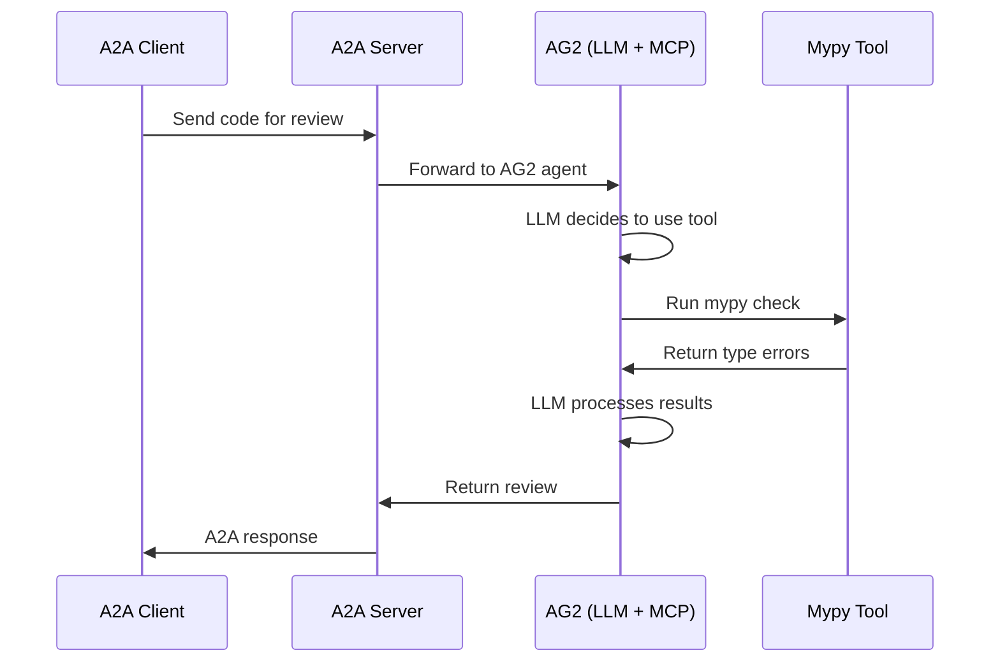

# AG2 Mypy Agent Reference

> **Source**: `samples/python/agents/ag2/`
> **Our Implementation**: Not started

## Overview

An AG2 (AutoGen 2) agent that performs Python code review using Mypy as an MCP tool. Demonstrates the "agent-as-a-service" architecture where agent logic, tools, and environment are encapsulated in a separate A2A-accessible service.

## Architecture

```
┌─────────────┐     ┌─────────────────┐     ┌─────────────────┐
│  A2A Client │────►│  A2A Protocol   │────►│   AG2 Agent     │
│  (CodeGen)  │◄────│  (JSON-RPC)     │◄────│  (LLM + MCP)    │
└─────────────┘     └─────────────────┘     └────────┬────────┘
                                                     │
                                              ┌──────▼──────┐
                                              │  Mypy Tool  │
                                              │   (MCP)     │
                                              └─────────────┘
```

## Key Components

### 1. Remote Agent (A2A Server)

`a2a_python_reviewer.py` - The AG2 agent exposed via A2A:

```python
# AG2 agent with MCP tools
agent = AssistantAgent(
    name="python_reviewer",
    model="gpt-4o",
    tools=[mypy_tool],  # MCP tool for type checking
)

# Expose via A2A
a2a_server = A2AServer(agent)
a2a_server.run(port=10000)
```

### 2. A2A Clients

Two client implementations that communicate with the remote agent:

**CLI Client** (`cli_codegen_a2a_client.py`):
```python
# Generate code and send for review
client = A2AClient("http://localhost:10000")
response = await client.send_message(
    "Review this Python code for type errors: ..."
)
```

**FastAPI Client** (`fastapi_codegen_a2a_client.py`):
```python
# Web API that uses the remote agent
@app.post("/review")
async def review_code(code: str):
    return await a2a_client.send_message(f"Review: {code}")
```

### 3. MCP Tool Integration

```python
# Mypy tool via MCP
@mcp_tool
def mypy_check(code: str) -> str:
    """Run mypy type checker on Python code."""
    result = subprocess.run(
        ["mypy", "--strict", "-"],
        input=code,
        capture_output=True,
        text=True,
    )
    return result.stdout + result.stderr
```

## A2A Protocol Flow



## Key Features

1. **Agent-as-a-Service**: Encapsulated agent logic accessible via A2A
2. **MCP Integration**: Tools exposed via Model Context Protocol
3. **Multiple Clients**: Same agent, different client interfaces
4. **Cross-Framework**: A2A enables framework interoperability

## Use Cases

- Code review automation
- CI/CD integration
- IDE plugins
- Multi-agent code generation pipelines

## TypeScript Implementation Approach

### Agent with Code Analysis Tool

```typescript
const pythonReviewerAgent = new ToolLoopAgent({
  model,
  instructions: `You are a Python code reviewer. 
    Use the type_check tool to analyze code for type errors.
    Provide detailed feedback on issues found.`,
  tools: {
    type_check: tool({
      description: "Run type checking on Python code",
      parameters: z.object({
        code: z.string().describe("Python code to check"),
      }),
      execute: async ({ code }) => {
        // In Workers, call external service
        const response = await fetch("https://type-checker.example.com/check", {
          method: "POST",
          body: JSON.stringify({ code, language: "python" }),
        });
        return response.json();
      },
    }),
  },
});
```

### Challenges for Workers

1. **No subprocess**: Can't run mypy directly in Workers
2. **External Service**: Need type-checking API
3. **Language Support**: Python-specific tools

### Alternative: JavaScript/TypeScript Linting

```typescript
const typescriptReviewerAgent = new ToolLoopAgent({
  model,
  instructions: "You are a TypeScript code reviewer...",
  tools: {
    lint_code: tool({
      description: "Lint TypeScript code",
      parameters: z.object({
        code: z.string(),
      }),
      execute: async ({ code }) => {
        // Use ESLint or similar
        const linter = new ESLint();
        const results = await linter.lintText(code);
        return results;
      },
    }),
  },
});
```

## Checklist for Implementation

- [ ] Code review agent with tool
- [ ] External type-checking service integration
- [ ] Multiple client examples
- [ ] Worker deployment

## Notes

The key insight from this example is the **agent-as-a-service** pattern:

1. **Encapsulation**: Agent + tools + environment in one service
2. **Reusability**: Multiple clients can use the same agent
3. **Interoperability**: A2A enables cross-framework communication

For our TypeScript implementation, we can apply this pattern with:
- AI SDK agents exposed via A2A
- Tools that call external services
- Multiple client interfaces (CLI, web, other agents)

