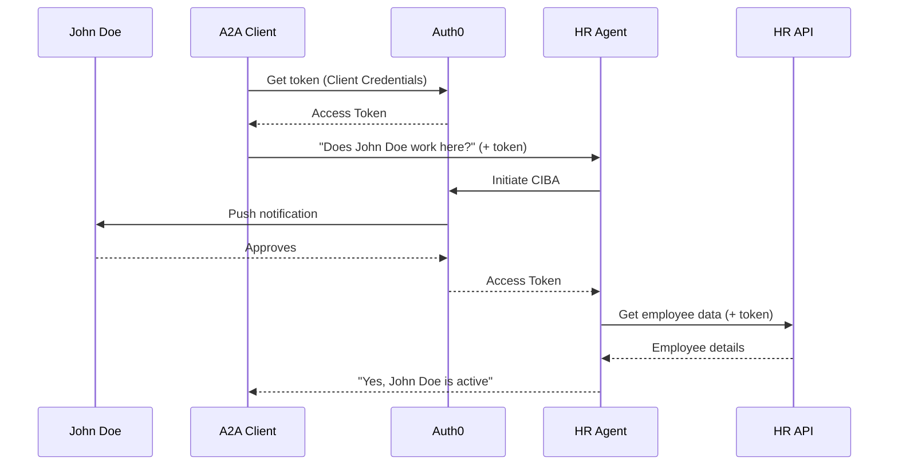

# Headless Agent Authentication Reference

> **Source**: `samples/python/agents/headless_agent_auth/`
> **Our Implementation**: Not started

## Overview

Demonstrates authentication patterns for headless agents using Auth0's Client-Initiated Backchannel Authentication (CIBA) flow. Shows how agents can request user authorization via push notification and obtain tokens for API access.

## Architecture

```
┌─────────────┐     ┌─────────────────┐     ┌─────────────────┐
│  A2A Client │────►│  A2A Protocol   │────►│  Staff0 HR Agent│
│             │◄────│  (+ OAuth)      │◄────│                 │
└─────────────┘     └─────────────────┘     └────────┬────────┘
                                                     │
                           ┌─────────────────────────┼─────────────────────────┐
                           │                         │                         │
                      ┌────▼────┐              ┌─────▼─────┐             ┌─────▼─────┐
                      │  Auth0  │              │ Employee  │             │  HR API   │
                      │  (CIBA) │◄─────────────│  (Push)   │             │           │
                      └─────────┘              └───────────┘             └───────────┘
```

## Key Components

### 1. Client Credentials Flow (Agent-Level Auth)

```python
# A2A Client authenticates to access the HR Agent
client_token = await auth0.get_token(
    grant_type="client_credentials",
    client_id=CLIENT_ID,
    client_secret=CLIENT_SECRET,
    audience="https://staff0/agent",
)

# Use token to call HR Agent
response = await a2a_client.send_message(
    "Does John Doe work at Staff0?",
    headers={"Authorization": f"Bearer {client_token}"},
)
```

### 2. CIBA Flow (User Authorization)

```python
# HR Agent requests user authorization via push notification
ciba_response = await auth0.initiate_ciba(
    client_id=AGENT_CLIENT_ID,
    client_secret=AGENT_CLIENT_SECRET,
    scope="read:employee",
    login_hint=employee_email,
)

# Poll for user approval
while True:
    token_response = await auth0.poll_ciba(ciba_response.auth_req_id)
    if token_response.access_token:
        break
    await asyncio.sleep(5)

# Use token to access HR API
hr_data = await hr_api.get_employee(
    employee_email,
    headers={"Authorization": f"Bearer {token_response.access_token}"},
)
```

### 3. Auth0 Configuration

```
APIs:
  - HR API (audience: https://staff0/api, permissions: read:employee)
  - HR Agent (audience: https://staff0/agent, permissions: read:employee_status)

Applications:
  - A2A Client (Client Credentials → HR Agent)
  - HR Agent (CIBA → HR API)
```

## A2A Protocol Flow



## Key Features

1. **Agent-Level Auth**: Client Credentials for A2A access
2. **User Consent**: CIBA for sensitive operations
3. **Push Notifications**: Auth0 Guardian for approval
4. **Token Scoping**: Minimal permissions per operation

## TypeScript Implementation Considerations

### Auth0 Integration

```typescript
import { Auth0Client } from '@auth0/auth0-spa-js';

// Client Credentials (server-side)
const getAgentToken = async () => {
  const response = await fetch(`https://${AUTH0_DOMAIN}/oauth/token`, {
    method: 'POST',
    headers: { 'Content-Type': 'application/json' },
    body: JSON.stringify({
      grant_type: 'client_credentials',
      client_id: CLIENT_ID,
      client_secret: CLIENT_SECRET,
      audience: AGENT_AUDIENCE,
    }),
  });
  return response.json();
};

// CIBA (for user authorization)
const initiateCIBA = async (userEmail: string) => {
  const response = await fetch(`https://${AUTH0_DOMAIN}/oauth/par`, {
    method: 'POST',
    headers: { 'Content-Type': 'application/x-www-form-urlencoded' },
    body: new URLSearchParams({
      client_id: AGENT_CLIENT_ID,
      client_secret: AGENT_CLIENT_SECRET,
      scope: 'read:employee',
      login_hint: userEmail,
    }),
  });
  return response.json();
};
```

### Middleware for A2A Server

```typescript
// Verify incoming A2A requests
const authMiddleware = async (c: Context, next: Next) => {
  const token = c.req.header('Authorization')?.replace('Bearer ', '');
  
  if (!token) {
    return c.json({ error: 'Unauthorized' }, 401);
  }
  
  const decoded = await verifyToken(token, {
    audience: AGENT_AUDIENCE,
    issuer: `https://${AUTH0_DOMAIN}/`,
  });
  
  c.set('user', decoded);
  await next();
};
```

## Challenges for Workers

1. **Secret Management**: Store client secrets securely
2. **Token Caching**: Cache tokens to reduce auth calls
3. **CIBA Polling**: Long-running operations in Workers

### Cloudflare Secrets

```bash
# Store secrets
wrangler secret put AUTH0_CLIENT_SECRET
wrangler secret put AUTH0_DOMAIN
```

```typescript
// Access in Worker
const clientSecret = env.AUTH0_CLIENT_SECRET;
```

## Checklist for Implementation

- [ ] Client Credentials flow
- [ ] JWT verification middleware
- [ ] CIBA flow (requires Auth0 Enterprise)
- [ ] Token caching
- [ ] Worker deployment with secrets

## Notes

This example demonstrates enterprise-grade authentication:
- **Zero Trust**: Every request authenticated
- **User Consent**: Sensitive operations require approval
- **Audit Trail**: All access logged via Auth0

For simpler use cases:
- API keys for internal agents
- JWT for external access
- Skip CIBA if no user consent needed

