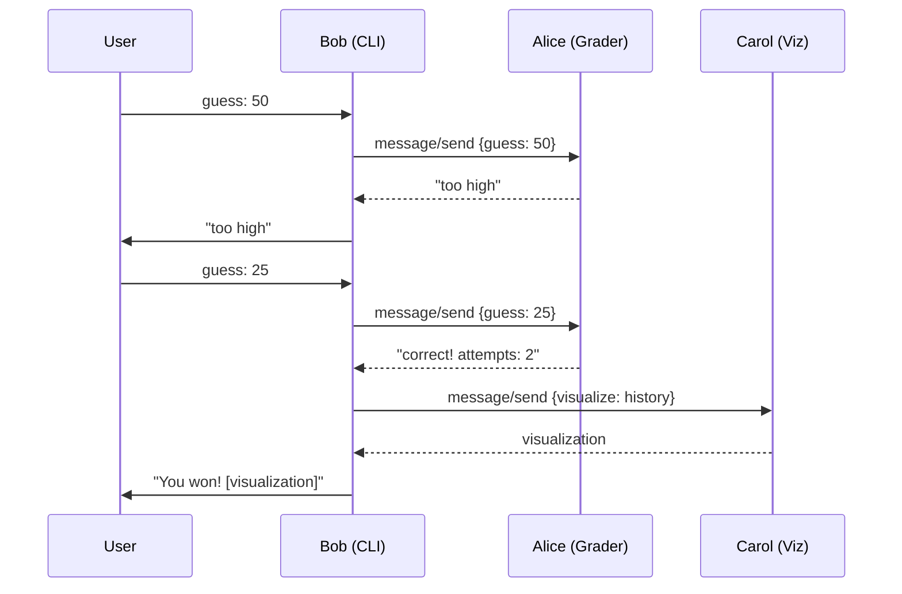

# Number Guessing Game Reference

> **Source**: `samples/python/agents/number_guessing_game/`
> **Our Implementation**: `examples/agents/number-game/` + `examples/workers/number-game-*` ✅

## Overview

A minimalist multi-agent demo with three cooperating agents playing a number guessing game. No LLMs required - demonstrates core A2A concepts with pure Python logic.

## Architecture

```
┌─────────────┐
│  AgentBob   │ (CLI Front-end)
│  Port 8002  │
└──────┬──────┘
       │
       ├─────────────────────┐
       │                     │
┌──────▼──────┐       ┌──────▼──────┐
│ AgentAlice  │       │ AgentCarol  │
│  Port 8000  │       │  Port 8001  │
│  (Grader)   │       │ (Visualizer)│
└─────────────┘       └─────────────┘
```

## Agent Roles

| Agent | Role | Port |
|-------|------|------|
| **Alice** | Picks secret number (1-100), grades guesses | 8000 |
| **Bob** | CLI interface, relays guesses, coordinates | 8002 |
| **Carol** | Visualizes guess history, shuffles on request | 8001 |

## Key Components

### 1. Alice (Grader)

```python
class AliceAgent:
    def __init__(self):
        self.secret = random.randint(1, 100)
    
    def grade(self, guess: int) -> str:
        if guess == self.secret:
            return f"correct! attempts: {self.attempts}"
        elif guess < self.secret:
            return "too low"
        else:
            return "too high"
```

### 2. Bob (Coordinator)

```python
class BobAgent:
    async def play(self):
        while True:
            guess = int(input("Enter guess: "))
            
            # Send to Alice for grading
            result = await self.call_alice(guess)
            print(f"Alice says: {result}")
            
            if "correct" in result:
                # Ask Carol to visualize
                viz = await self.call_carol("visualize")
                print(viz)
                break
```

### 3. Carol (Visualizer)

```python
class CarolAgent:
    def visualize(self, history: list) -> str:
        return "\n".join([f"{i}: {'*' * g}" for i, g in enumerate(history)])
    
    def shuffle(self, history: list) -> list:
        random.shuffle(history)
        return history
```

## A2A Protocol Flow



## Key Features

1. **No LLM**: Pure logic, no API keys
2. **Multi-Agent**: Three cooperating agents
3. **Local**: All agents run on localhost
4. **Educational**: Minimal complexity

## A2A Feature Coverage

| Feature | Status |
|---------|--------|
| `message/send` | ✅ Implemented |
| Task aggregation | ✅ Via SDK |
| Streaming | ❌ Not implemented |
| Push notifications | ❌ Not implemented |

## TypeScript Implementation Approach

### Alice Agent (No LLM)

```typescript
class AliceAgent {
  private secret: number;
  private attempts: number = 0;

  constructor() {
    this.secret = Math.floor(Math.random() * 100) + 1;
  }

  grade(guess: number): string {
    this.attempts++;
    if (guess === this.secret) {
      return `correct! attempts: ${this.attempts}`;
    }
    return guess < this.secret ? "too low" : "too high";
  }
}

// A2A handler (no ToolLoopAgent needed)
app.post("/", async (c) => {
  const { params } = await c.req.json();
  const guess = parseInt(params.message.parts[0].text);
  const result = alice.grade(guess);
  
  return c.json({
    jsonrpc: "2.0",
    result: {
      status: { state: "completed" },
      artifacts: [{ parts: [{ type: "text", text: result }] }],
    },
  });
});
```

### Bob Agent (Coordinator)

```typescript
import { A2AClient } from "a2a-client";

const aliceClient = new A2AClient("http://localhost:8000");
const carolClient = new A2AClient("http://localhost:8001");

async function play() {
  const readline = require("readline").createInterface({
    input: process.stdin,
    output: process.stdout,
  });

  while (true) {
    const guess = await question("Enter guess: ");
    const result = await aliceClient.sendMessage(guess);
    console.log(`Alice says: ${result}`);

    if (result.includes("correct")) {
      const viz = await carolClient.sendMessage("visualize");
      console.log(viz);
      break;
    }
  }
}
```

## Checklist for Implementation

- [x] Alice agent (grader logic) - `number-game/alice/`
- [x] Carol agent (visualizer) - `number-game/carol/`
- [x] Worker: Alice - `workers/number-game-alice/`
- [x] Worker: Carol - `workers/number-game-carol/`
- [x] No LLM dependency
- [ ] Bob agent (CLI coordinator) - optional, use any A2A client

## Notes

This example is valuable for:
- **Learning A2A**: No LLM complexity
- **Testing**: Deterministic behavior
- **Demos**: Quick to run, no API keys

The pattern shows that A2A works for any agent, not just LLM-based ones. Useful for:
- Game logic
- Workflow coordination
- Testing infrastructure
- Educational purposes

