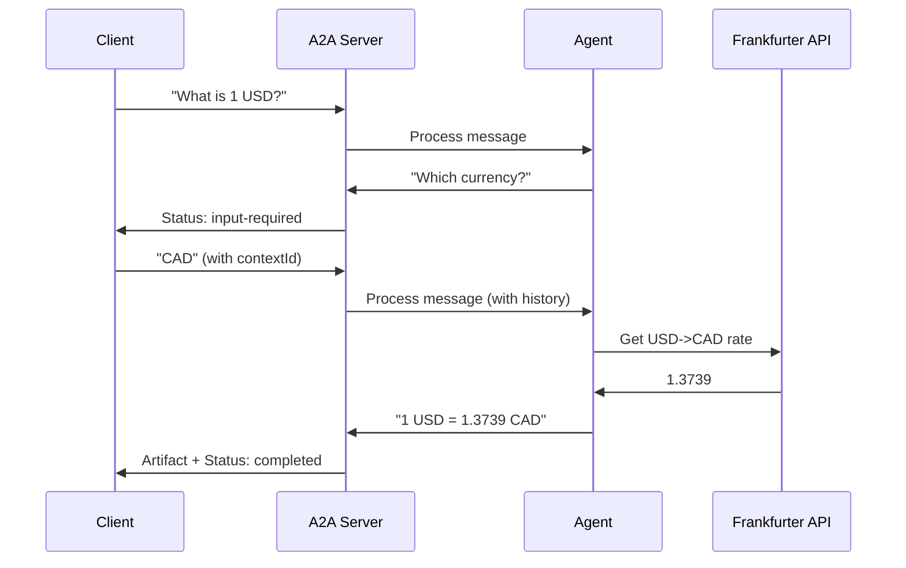

# Currency Agent

An A2A agent that demonstrates multi-turn conversation and currency conversion.

## Overview

This agent showcases **multi-turn conversation** with **currency conversion**:
- 💱 **Currency Conversion** - Real-time exchange rates via Frankfurter API
- 💬 **Multi-Turn Conversation** - Can ask for missing information
- 🧠 **Conversation Memory** - Maintains context across turns
- ⚡ **Streaming** - Real-time status updates
- 📦 **Artifacts** - Conversion results as text artifacts

## What It Does

**Capabilities:**
- Convert amounts between currencies (30+ supported)
- Provide current exchange rates
- Request additional information when needed (e.g., target currency)
- Maintain conversation context via `contextId`

**Example Interactions:**
- "What is 100 USD in EUR?" → Immediate conversion
- "What is the exchange rate for 1 USD?" → Asks "Which currency?"
- [User replies] "CAD" → Provides conversion

## Architecture

```
currency-agent/
├── tools.ts    # Frankfurter API integration
├── agent.ts    # AI SDK ToolLoopAgent (1 tool)
├── index.ts    # A2A integration with multi-turn support
├── prompt.ts   # System prompt
└── README.md   # This file
```

## Why This Example?

The Currency Agent is the **first multi-turn example** because it demonstrates:

1. **Multi-Turn Conversation** - Agent can request missing information
2. **Conversation Memory** - Uses `contextId` to track context
3. **Custom State Parsing** - Detects "input-required" vs "completed"
4. **External API Integration** - Real-time data from Frankfurter
5. **Streaming Status Updates** - Progress messages during API calls

This builds on previous examples by adding **conversational intelligence** and showing how agents can interact naturally across multiple turns.

## Quick Start

### 1. Install Dependencies

```bash
cd samples/js
pnpm install
```

### 2. Set Environment Variables

```bash
# Required: AI provider API key
export OPENAI_API_KEY=your_openai_api_key

# Optional: Change AI provider/model
export AI_PROVIDER=openai
export AI_MODEL=gpt-4o-mini
```

**Note**: No API key needed for currency conversion (Frankfurter API is free).

### 3. Start the Agent

```bash
# From project root
pnpm agents:currency-agent

# Or from samples/js
pnpm tsx src/agents/currency-agent/index.ts
```

The agent will start on **port 41248** by default.

## Usage Examples

### Complete Request (Single Turn)

```bash
curl -X POST http://localhost:41248/message/send \
  -H "Content-Type: application/json" \
  -d '{
    "message": {
      "role": "user",
      "parts": [{"kind": "text", "text": "What is 100 USD in EUR?"}]
    }
  }'
```

**Response**: Immediate conversion result with artifact.

### Incomplete Request (Multi-Turn)

**Request 1**: Missing target currency

```bash
curl -X POST http://localhost:41248/message/send \
  -H "Content-Type: application/json" \
  -d '{
    "message": {
      "role": "user",
      "parts": [{"kind": "text", "text": "What is the exchange rate for 1 USD?"}]
    }
  }'
```

**Response 1**: Task status = "input-required", agent asks "Please specify which currency you would like to convert to."

**Request 2**: Provide target currency (with `contextId` and `taskId` from Response 1)

```bash
curl -X POST http://localhost:41248/message/send \
  -H "Content-Type: application/json" \
  -d '{
    "message": {
      "contextId": "CONTEXT_ID_FROM_RESPONSE_1",
      "taskId": "TASK_ID_FROM_RESPONSE_1",
      "role": "user",
      "parts": [{"kind": "text", "text": "CAD"}]
    }
  }'
```

**Response 2**: Task status = "completed", agent provides conversion with artifact.

### Streaming Request

```bash
curl -X POST http://localhost:41248/message/stream \
  -H "Content-Type: application/json" \
  -d '{
    "message": {
      "role": "user",
      "parts": [{"kind": "text", "text": "Convert 50 GBP to JPY"}]
    }
  }'
```

**Streaming Events**:
1. Task submitted
2. Status: "Looking up the exchange rates..."
3. Status: "Processing the exchange rates.."
4. Artifact: Conversion result
5. Task completed

### Agent Card

```bash
curl http://localhost:41248/.well-known/agent-card.json
```

## Technical Details

### Currency API

**Frankfurter API** - Free, no API key required
- **Endpoint**: `https://api.frankfurter.app/`
- **Currencies**: 30+ (EUR, USD, GBP, JPY, CAD, AUD, etc.)
- **Features**: Current rates, historical data
- **Rate Limit**: Generous (no authentication needed)

### Supported Currencies

Frankfurter supports major currencies:
- **Americas**: USD, CAD, MXN, BRL
- **Europe**: EUR, GBP, CHF, NOK, SEK, DKK, PLN, CZK
- **Asia**: JPY, CNY, INR, SGD, HKD, KRW, THB, IDR, MYR, PHP
- **Oceania**: AUD, NZD
- **Other**: ZAR, TRY, ILS

### Tool Definition

The agent has **one tool**: `get_exchange_rate`

```typescript
{
  get_exchange_rate: {
    description: "Get current exchange rate between two currencies",
    inputSchema: z.object({
      currencyFrom: z.string().length(3).describe("Source currency (e.g., USD)"),
      currencyTo: z.string().length(3).describe("Target currency (e.g., EUR)"),
      currencyDate: z.string().optional().describe("Date or 'latest'"),
    }),
    execute: async (params) => {
      const result = await getExchangeRate(...);
      return { success: true, rate, ... };
    },
  },
}
```

### Multi-Turn Conversation Flow



### Custom State Parsing

The agent uses **text-based state detection** to determine if more input is needed:

```typescript
function parseTaskState(response: string): "input-required" | "completed" {
  const lowerResponse = response.toLowerCase();

  // Detect questions or requests for information
  if (
    lowerResponse.includes("please specify") ||
    lowerResponse.includes("which currency") ||
    lowerResponse.includes("?")
  ) {
    return "input-required";
  }

  return "completed";
}
```

**Why this approach?**
- AI SDK ToolLoopAgent returns text responses (not structured)
- Python LangGraph version uses explicit `ResponseFormat` for status
- Text parsing is simple and works well for this use case
- Alternative: Use structured output (more complex)

### Conversation Memory

**Managed by A2AAdapter:**
- Each conversation gets a unique `contextId`
- Messages are stored with `contextId` + `taskId`
- Agent receives full conversation history
- ToolLoopAgent maintains internal state

**Storage**:
- In-memory (not persisted)
- Resets on server restart
- Production: Use persistent storage (Redis, Database)

### Streaming Status Updates

The adapter emits status messages during processing:

```typescript
streamingConfig: {
  enableStatusUpdates: true,
  statusMessages: [
    "Looking up the exchange rates...",
    "Processing the exchange rates..",
  ],
}
```

**Events emitted:**
1. **TaskStatusUpdateEvent** - "Looking up exchange rates..."
2. **TaskStatusUpdateEvent** - "Processing exchange rates..."
3. **TaskArtifactUpdateEvent** - Conversion result
4. **TaskStatusUpdateEvent** - Task completed

### Artifact Structure

```typescript
{
  artifactId: "conversion-1234567890-abc123",
  name: "conversion_result",
  mimeType: "text/plain",
  data: "base64-encoded-conversion-result"
}
```

## Comparison to Python LangGraph Version

| Feature | Python (LangGraph) | JavaScript (AI SDK) |
|---------|-------------------|---------------------|
| **Framework** | LangGraph + ReAct | AI SDK ToolLoopAgent |
| **State Management** | Structured output | Text parsing |
| **Memory** | Checkpointer | In-memory history |
| **Tools** | @tool decorator | ToolLoopAgent tools |
| **Streaming** | Custom executor | A2AAdapter streaming |
| **State Detection** | ResponseFormat | parseTaskState() |

**Key Difference**: LangGraph uses structured output (`ResponseFormat`) to explicitly indicate task state, while AI SDK uses text parsing. Both approaches work well!

## Comparison to Other Agents

| Feature | Hello | Dice | GitHub | Analytics | Currency |
|---------|-------|------|--------|-----------|----------|
| Tools | ❌ | ✅ | ✅ | ❌ | ✅ |
| External API | ❌ | ❌ | ✅ | ❌ | ✅ |
| Artifacts | ❌ | ❌ | ❌ | ✅ | ✅ |
| Streaming | ❌ | ❌ | ❌ | ✅ | ✅ |
| Multi-Turn | ❌ | ❌ | ❌ | ❌ | ✅ |
| Memory | ❌ | ❌ | ❌ | ❌ | ✅ |
| Complexity | ⭐ | ⭐⭐ | ⭐⭐⭐ | ⭐⭐⭐⭐ | ⭐⭐⭐ |

**Currency Agent** is unique because it's the only one with **multi-turn conversation** and **conversation memory**.

## Port

- **Default**: 41248
- **Configurable**: Edit `PORT` constant in `index.ts`

## Environment Variables

| Variable | Required | Default | Description |
|----------|----------|---------|-------------|
| `OPENAI_API_KEY` | ✅ (or other provider) | - | API key for LLM provider |
| `AI_PROVIDER` | ❌ | `openai` | Provider: openai, anthropic, google, etc. |
| `AI_MODEL` | ❌ | `gpt-4o-mini` | Model to use |

## Learning Path

This agent teaches:

### 1. Multi-Turn Conversation Pattern
```typescript
// Detect if agent is asking for more info
if (response.includes("please specify")) {
  return "input-required"; // Don't complete task yet
}
return "completed"; // Task is done
```

### 2. Conversation Memory
- Use `contextId` to track conversations
- Pass full history to agent
- Maintain state across requests

### 3. Custom State Parsing
- Parse text responses to infer state
- Alternative to structured output
- Simple and effective

### 4. External API Integration
- Frankfurter API (no auth required)
- Error handling for API failures
- Data validation

## Troubleshooting

### Conversation Context Lost
**Issue**: Agent doesn't remember previous messages
**Solution**: Ensure `contextId` and `taskId` are included in follow-up requests

### Agent Not Asking for Info
**Issue**: Agent tries to guess missing information instead of asking
**Solution**: Update system prompt to explicitly request missing details

### Currency Not Found
**Issue**: "Currency pair not found" error
**Solution**: Use 3-letter ISO codes (USD, EUR, etc.) - check Frankfurter API docs

### Multi-Turn Not Working
**Issue**: Task completes immediately instead of asking for input
**Solution**: Verify `parseTaskState()` function is detecting questions correctly

## Next Steps

After understanding the Currency Agent:
1. **Custom State Detection** - Experiment with different parsing strategies
2. **Structured Output** - Migrate to AI SDK structured output (alternative to text parsing)
3. **Persistent Memory** - Add Redis or database for conversation history
4. **More Tools** - Add currency list tool, historical rates tool

## Learn More

- [Frankfurter API Documentation](https://www.frankfurter.app/docs/)
- [A2A Protocol Documentation](https://google.github.io/A2A/)
- [AI SDK Documentation](https://sdk.vercel.ai/docs)
- [Multi-Turn Conversation Patterns](https://sdk.vercel.ai/docs/ai-sdk-core/tools-and-tool-calling)
- [Conversion Plan](../../../../../../../PYTHON_TO_JS_CONVERSION_PLAN.md)

